# Projeto do Curso de Pós-graduação - MIT Arquitetura de Software

## Disciplina: Integração Contínua, DevOps e Computação em Nuvem [25E1_3]

Este projeto, implementa uma aplicação com CI/CD via GitHub Actions, utilizando Docker e Kubernetes (Minikube). O ambiente inclui uma aplicação com múltiplas réplicas, banco de dados MySQL e monitoramento completo com Prometheus e Grafana. A infraestrutura conta com readiness/liveness probes, serviços LoadBalancer e persistência de dados com PVC. O projeto também realiza testes de estresse com k6 e disponibiliza os dashboards para análise de métricas como uso de CPU e memória.

Acesso ao repositório em:
[https://github.com/silviobassi/infnet-devops](https://github.com/silviobassi/infnet-devops.git)

## 1. Código Fonte com Configurações do Projeto

### 1.1. Pipeline de CI/CD com GitHub Actions - Acesse em 👇

- [.github/workflows/deploy.yml](https://github.com/silviobassi/infnet-devops/blob/main/.github/workflows/deploy.yml)

### 1.2. Manifestos e Configurações da Aplicação - Acesse em 👇

- [infra/manifests/k8s/app-deployment.yml](https://github.com/silviobassi/infnet-devops/tree/main/infra/manifests/k8s/app-deployment.yml)<br>
- [infra/manifests/k8s/app-service.yml](https://github.com/silviobassi/infnet-devops/tree/main/infra/manifests/k8s/app-service.yml)<br>
- [infra/manifests/k8s/mysql-config.yml](https://github.com/silviobassi/infnet-devops/tree/main/infra/manifests/k8s/mysql-config.yml)<br>
- [infra/manifests/k8s/mysql-deployment.yml](https://github.com/silviobassi/infnet-devops/tree/main/infra/manifests/k8s/mysql-deployment.yml)<br>
- [infra/manifests/k8s/mysql-service.yml](https://github.com/silviobassi/infnet-devops/tree/main/infra/manifests/k8s/mysql-service.yml)<br>

### 1.3. Manifestos e Configurações do Grafana e Prometheus - Acesse em 👇

- [infra/manifests/monitoring/monitoring_install.sh](https://github.com/silviobassi/infnet-devops/tree/main/infra/manifests/monitoring/monitoring_install.sh)<br>
- [infra/manifests/monitoring/prometheus-config.yml](https://github.com/silviobassi/infnet-devops/tree/main/infra/manifests/monitoring/prometheus-config.yml)<br>
- [infra/manifests/monitoring/values.yml](https://github.com/silviobassi/infnet-devops/tree/main/infra/manifests/monitoring/values.yml)<br>

### 1.4. Testes de Estresse - Acesse em 👇

- [stress-test/test_k6js](https://github.com/silviobassi/infnet-devops/blob/main/stress-test/test_k6.js)

## 2. Execução do Projeto

### 2.1. Instalação do Docker, Kubectl e Minikube (Se não estiverem instalados):

- [Instalação do Docker](https://docs.docker.com/engine/install/)
- [Instalação do Kubectl](https://kubernetes.io/docs/tasks/tools/install-kubectl-linux/)
- [Instalação do Minikube](https://minikube.sigs.k8s.io/docs/start/?arch=%2Flinux%2Fx86-64%2Fstable%2Fbinary+download)

### 2.2 Execução do Deploy do Projeto:

- Clone o repositório em sua máquina:

```bash
git clone https://github.com/silviobassi/infnet-devops.git
```

- ⚠️ No diretório do projeto, execute os comandos 👇

```bash
# Executa o deploy da aplicação (App e MySQL)
minikube start --driver=docker 
cd infra/manifests/k8s
kubectl apply -f app-namespace.yml
kubectl apply -f .

# Executa o deploy do monitoramento (Grafana e Prometheus)
cd ../monitoring
sh monitoring_install.sh
```

## 3. Demonstração do Projeto em Execução:

### 3.1. Pipeline de CI/CD com GitHub Actions em Execução:

- Pipeline de geração da imagem da aplicação

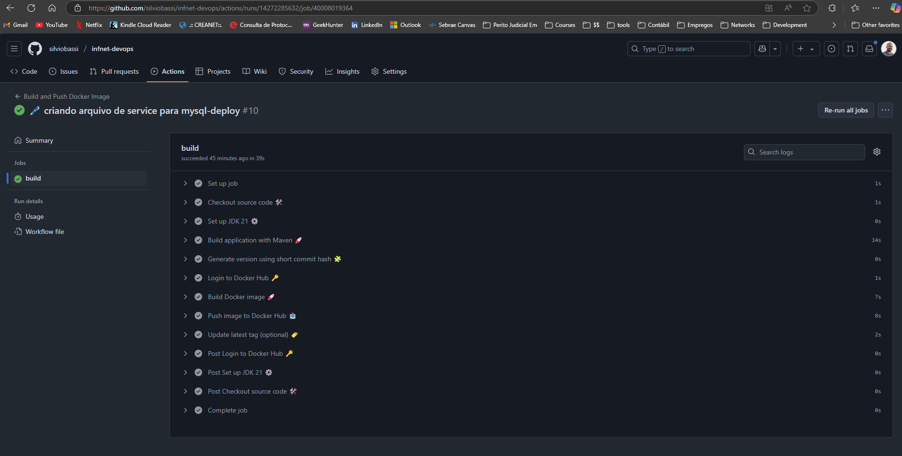

- Imagem publicada no Docker Hub após a execução do pipeline

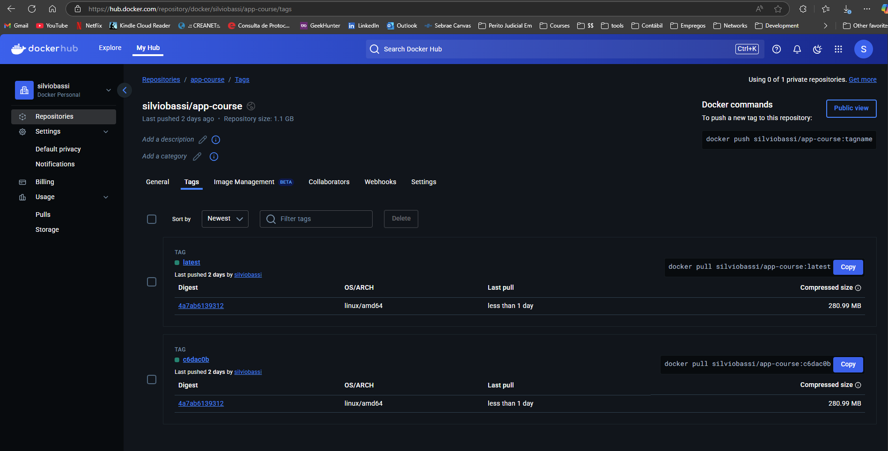

### 3.2. Aplicação em Execução:

- Deployment aplicado e exibição de pods, services e url para acesso a API da aplicação

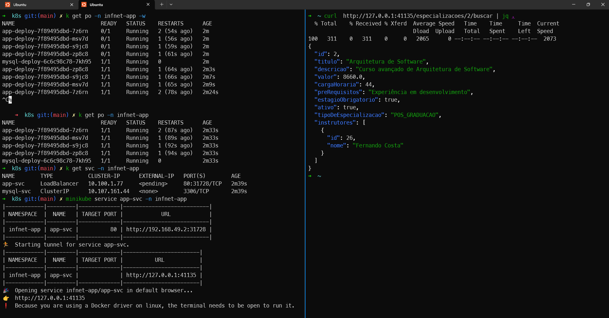

- Swagger para acesso a API da aplicação

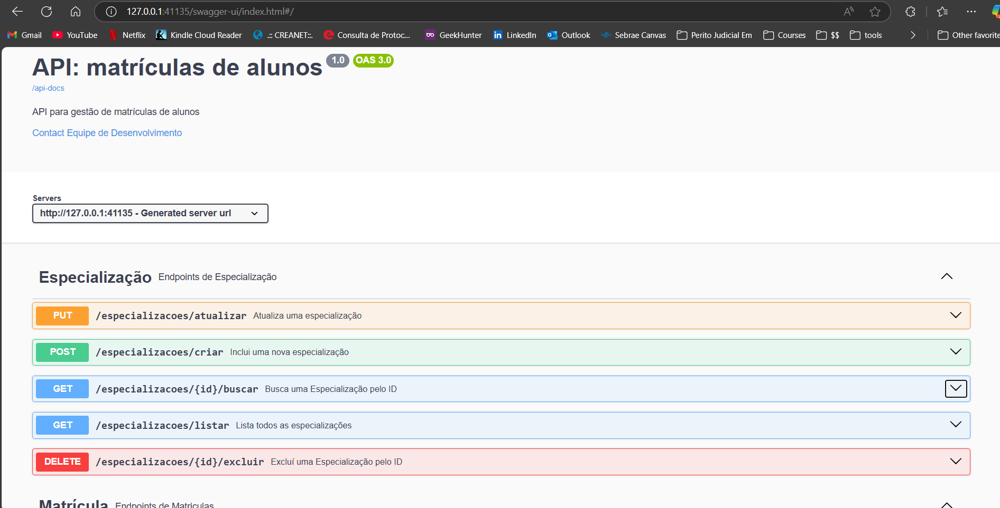

### 3.3. Estrutura de Monitoramento da  Aplicação com o Prometheus e o Grafana:

- Deployment aplicado

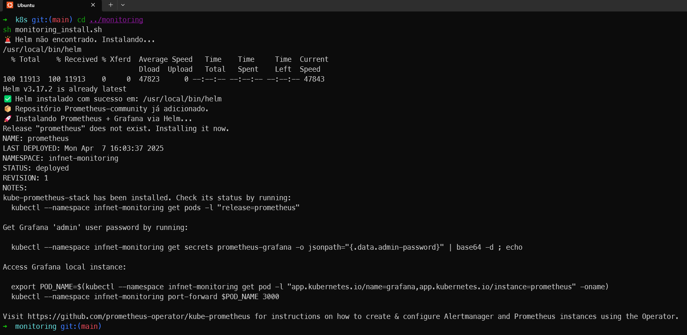

- Exibição de pods, services e pvc do monitoramento

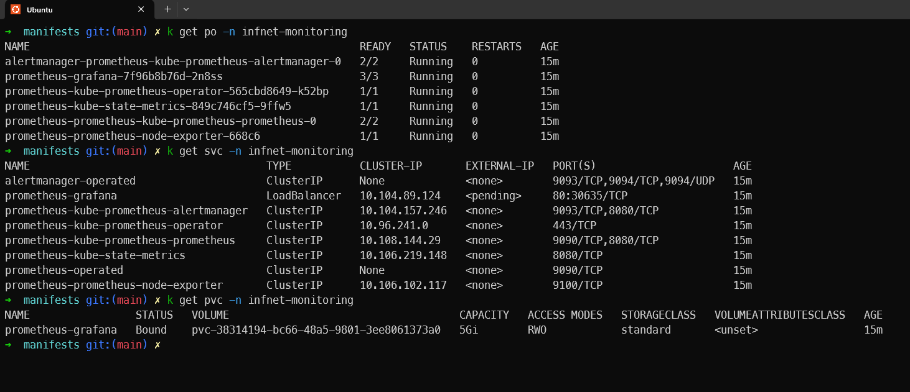

- O Prometheus só está exposto internamente _(ClusterIP)_, o acesso foi feito via _port-forward_

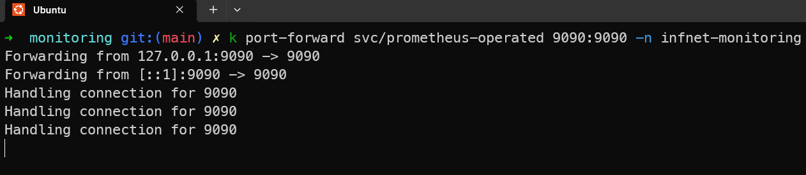

- Exibição do Prometheus em Execução

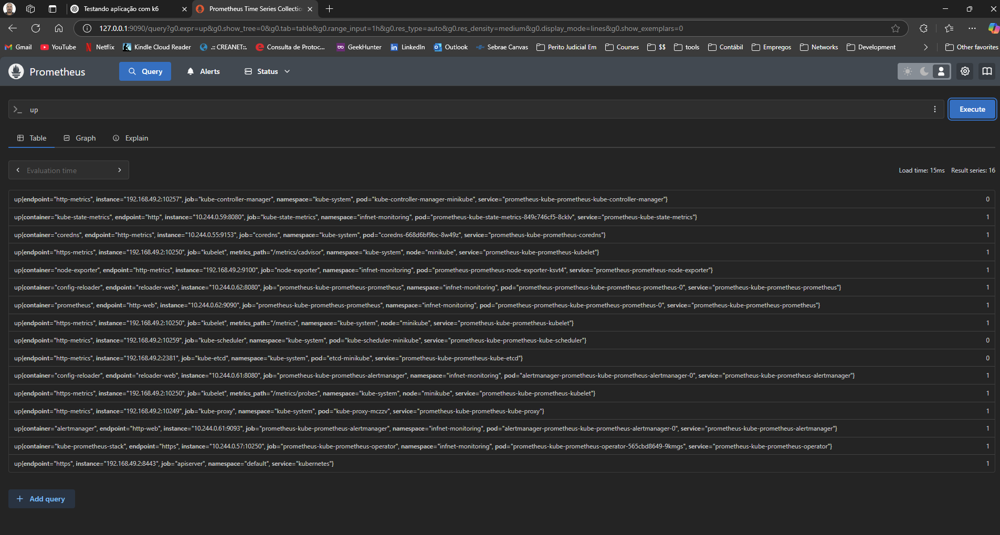

- Grafana conectado ao prometheus

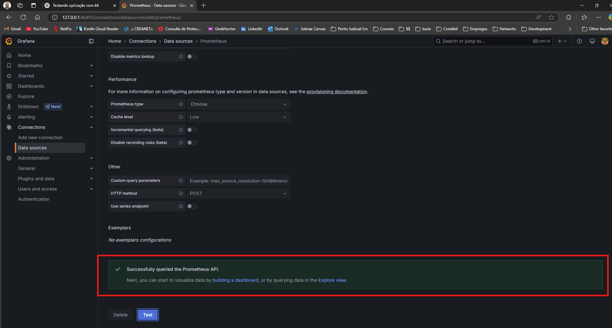

### 3.4. Execução de _Stress Test_ com o k6

- Teste em progresso

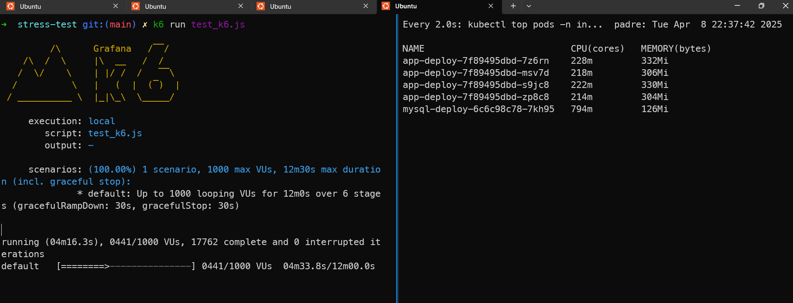

- Resultado final

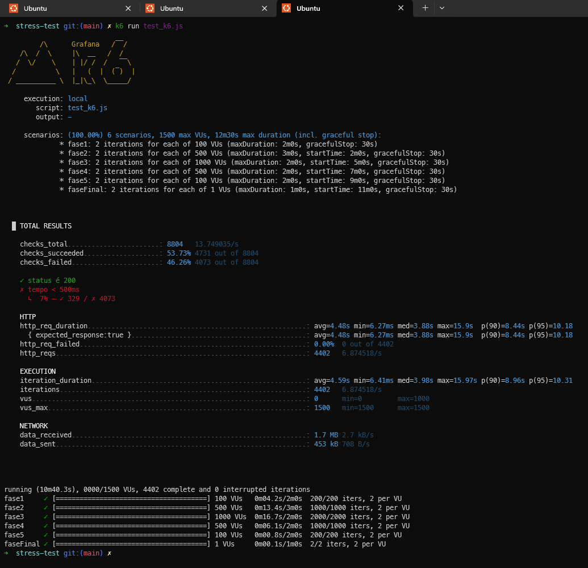

- Houve _down_ ou _up_ para todos os pods, na progressão do teste. Os _POD(s)_ foram reiniciados em até 16 vezes, como se observa na figura abaixo:

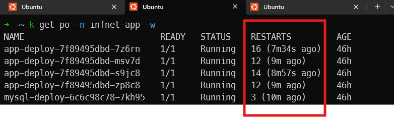

### 3.5. Resumo Geral do Teste

- Execução local
- Script: [stress-test/test_k6js](https://github.com/silviobassi/infnet-devops/blob/main/stress-test/test_k6.js)
- Cenários (scenarios): 6 fases diferentes, com até 1500 VUs ativos ao longo do tempo.
- Duração total: 12m30s, incluindo gracefulStop (tempo de tolerância para finalizar VUs ativos).
- Total de requisições HTTP: 4402
- Total de checagens (check) realizadas: 8804 (duas por requisição, provavelmente)

#### 3.5.1. Configuração das Fases do Teste

| Fase  | VUs (Usuários Virtuais) | Iterações por VU | Início | Duração Máxima (minutos) |
|-------|-------------------------|------------------|--------|--------------------------|
| 1     | 100                     | 2                | 0s     | 2m                       |
| 2     | 500                     | 2                | 2m     | 3m                       |
| 3     | 1000                    | 2                | 5m     | 2m                       |
| 4     | 500                     | 2                | 7m     | 2m                       |
| 5     | 100                     | 2                | 9m     | 2m                       |
| Final | 1                       | 2                | 11m    | 1m                       |

- _Observação_: ⚠️ A fase final é apenas simbólica — não contribui de forma significativa a carga

#### 3.5.2. Checks (Validações do Teste)

| Check         | Sucesso | Falha  | Observações                                              |
|---------------|---------|--------|----------------------------------------------------------|
| status é 200  | ✅ 4731  | ❌ 0    | Bom! Todas as respostas vieram com status 200.           |
| tempo < 500ms | ✅ 329   | ❌ 4073 | 😬 Apenas 7% das requisições foram rápidas o suficiente. |

#### 3.5.3. Desempenho HTTP

| Métrica        | Valor   |
|----------------|---------|
| Média          | 4.48s   |
| Mediana (p50)  | 3.88s   |
| p90            | 8.44s   |
| p95            | 10.18s  |
| Máximo         | 15.9s   |
| Mínimo         | 6.27ms  |


#### 3.5.4. Execução de Iterações e VUs

| Métrica               | Valor     |
|-----------------------|-----------|
| Total de Iterações    | 4402      |
| Iterações por segundo | 6.87/s    |
| Duração média         | 4.59s     |
| Mediana (p50)         | 3.98s     |
| p90                   | 8.96s     |
| p95                   | 10.31s    |
| Duração máxima        | 15.97s    |
| Duração mínima        | 6.41ms    |
| VUs em uso (mín-máx)  | 0 - 1000  |
| VUs máximos definidos | 1500      |

#### 3.5.5. Métricas de Rede

| Métrica          | Valor     |
|------------------|-----------|
| Dados recebidos  | 1.7 MB    |
| Taxa de download | ~2.7 kB/s |
| Dados enviados   | 453 KB    |
| Taxa de upload   | ~708 B/s  |

#### 3.5.6. Resumo Final de Execução

| Métrica                   | Valor        |
|---------------------------|--------------|
| Duração total da execução | 10m40.3s     |
| VUs ativos (mín-máx)      | 0 - 1000     |
| VUs máximos configurados  | 1500         |
| Total de requisições HTTP | 4402         |
| Falhas HTTP               | 0 (0.00%)    |

### 3.6. Dashboards do Grafana Expondo Dados Sensíveis dos _POD(s)_ da Aplicação  - _Sofrendo Alterações durante o _Stress Test_..._

- Consumo de memória para todos os _POD(s)_ - início

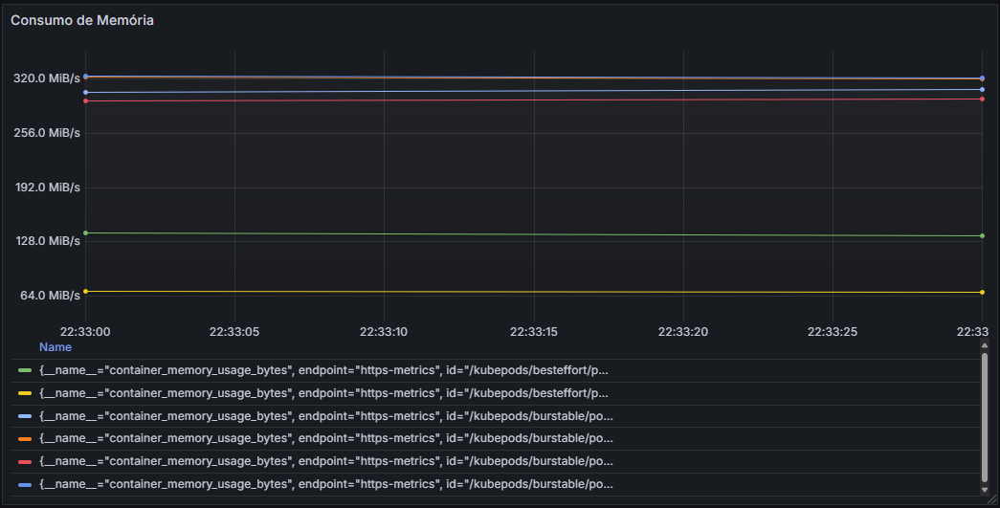

- Consumo de cpu para todos os _POD(s)_ - início

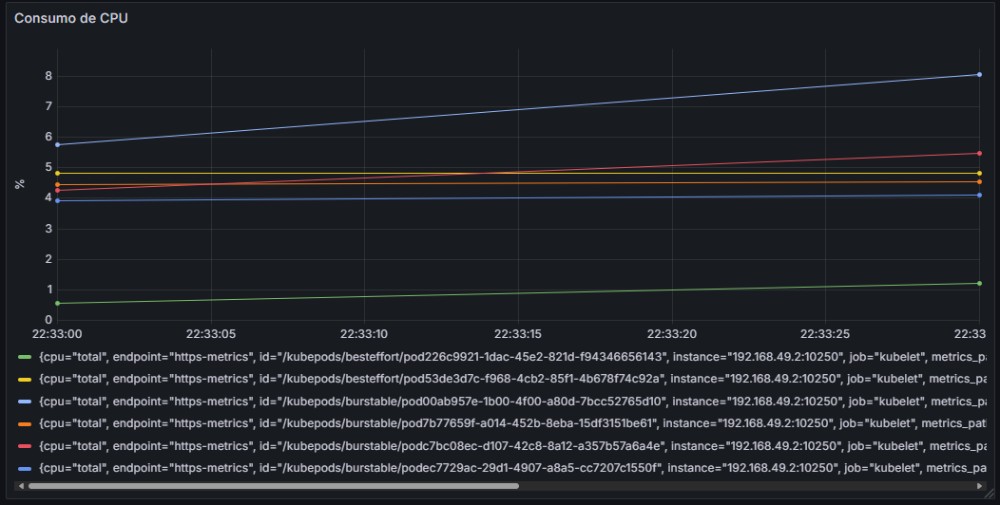

- Consumo de CPU do _POD_ com MySQL

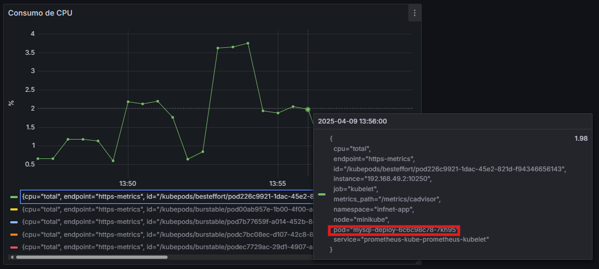

- Consumo de memória do _POD_ com MySQL

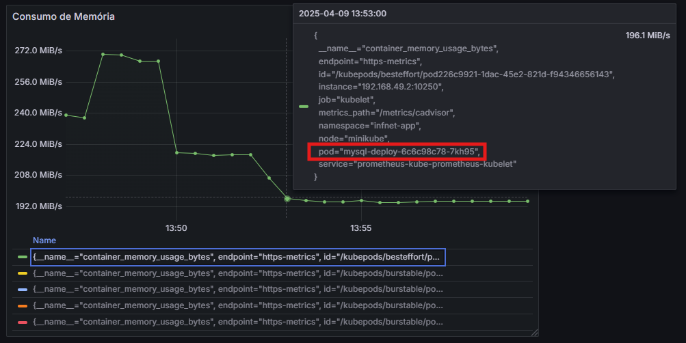

- Consumo de CPU em um _POD_ com a aplicação

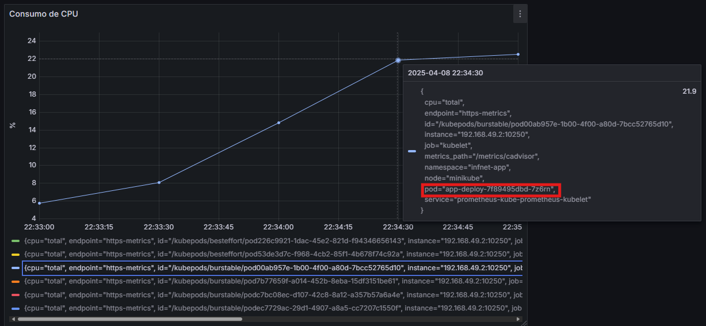

- Consumo de memória em um _POD_ com a aplicação

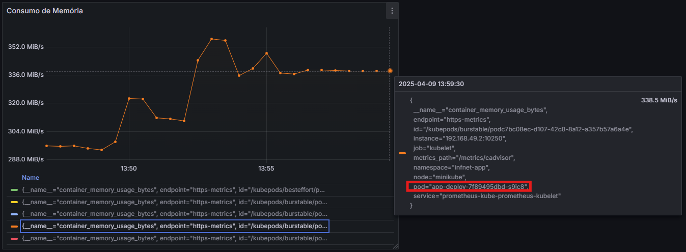

- Consumo de CPU pata todos os pods - sofrendo as últimas alterações

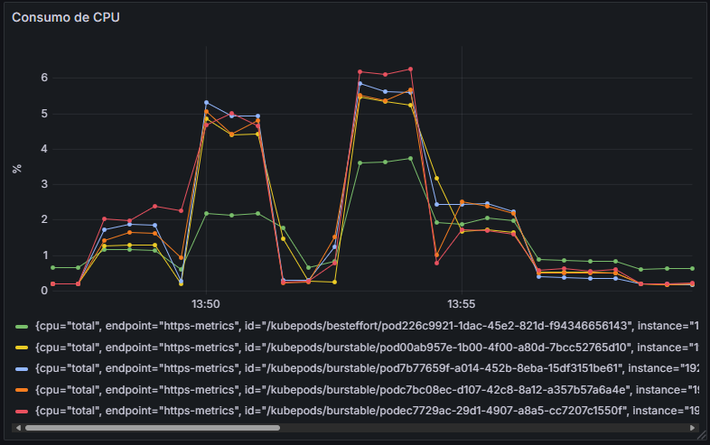

- Consumo de memória para todos os pods - sofrendo as últimas alterações

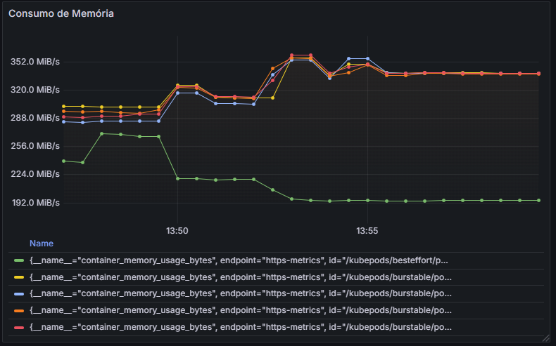

## Conclusão

✅ Pontos Fortes

- Nenhuma falha HTTP detectada (100% das respostas com status 200).
- Estrutura de CI/CD bem definida com GitHub Actions e automação via Minikube.
- Monitoramento completo com Prometheus e Grafana em funcionamento.
- Execução estável da aplicação com até 1000 usuários simultâneos.

⚠️ Pontos Fracos

- Apenas 7% das requisições foram concluídas abaixo de 500ms.
- Latência média elevada (~4.5s), com picos de até 15.9s.
- Consumo elevado de CPU e memória nos pods da aplicação e do MySQL.
- Reinicializações excessivas dos pods durante o teste de estresse.

🛠️ Recomendações para Melhoria

- Otimizar o backend e as consultas ao banco de dados.
- Implementar cache estratégico para dados mais acessados.
- Avaliar e ajustar os limites de CPU e memória dos nodes no Kubernetes.
- Ativar o autoescalonamento horizontal (HPA) baseado em métricas de uso.
- Revisar as configurações de readiness/liveness probes para evitar reinícios desnecessários.
- Verificar se o cluster possui nós suficientes para suportar a carga simulada.